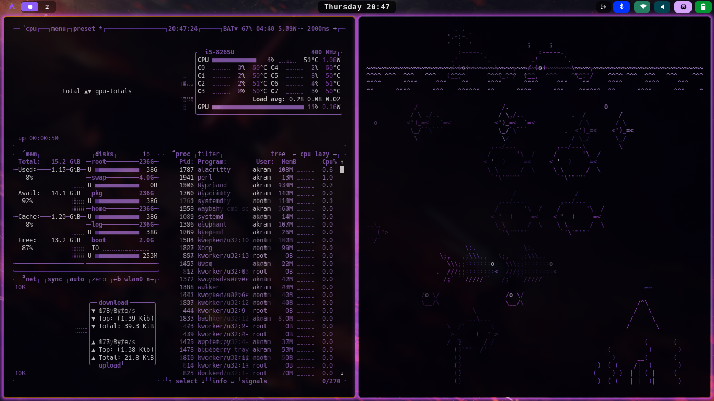
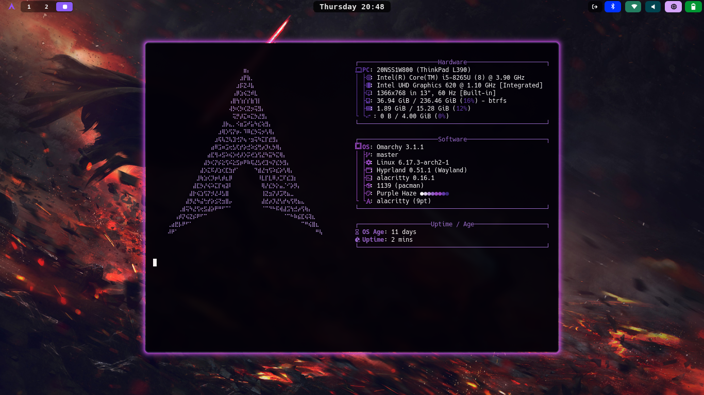
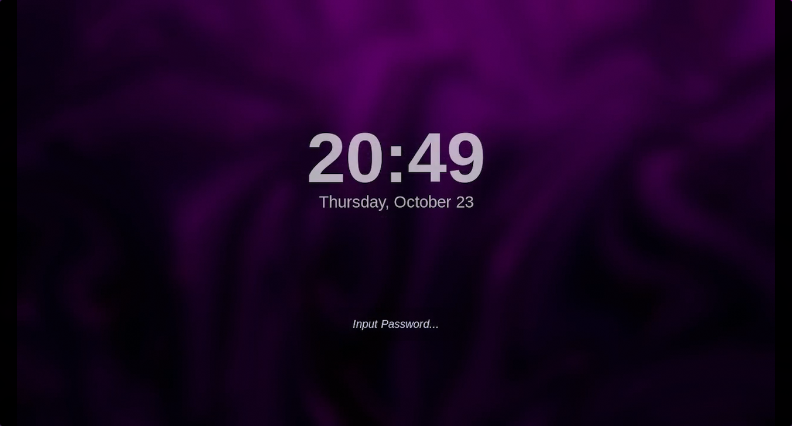
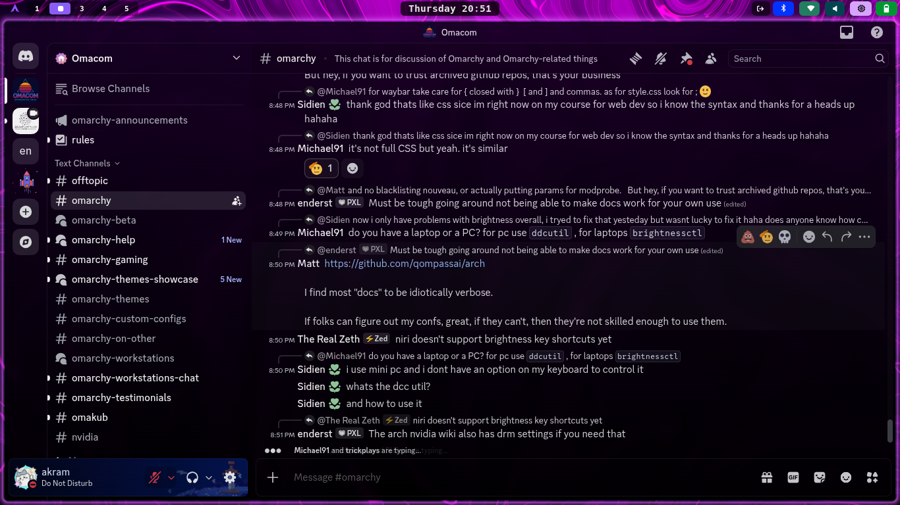
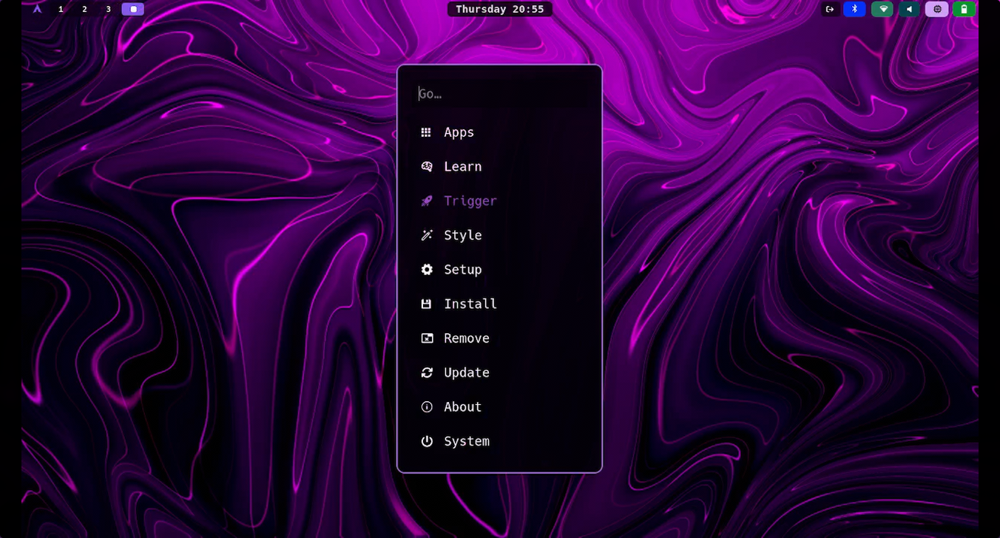
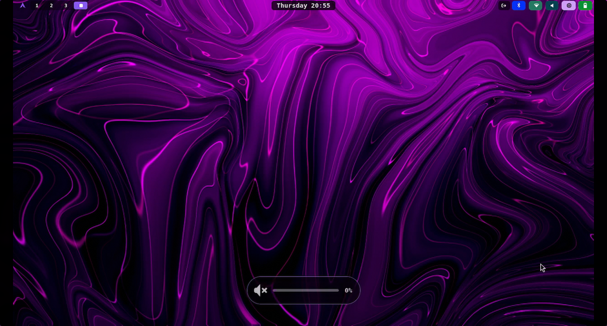

### What is Omarchy
Omarchy is an [omakase](https://learn.omacom.io/3/omacom/76/omakase-computing) distribution based on [Arch Linux](https://archlinux.org/) and the tiling window manager [Hyprland](https://hypr.land/). It ships with just about everything a modern software developer needs to be productive immediately.

Read more at [omarchy.org.](https://omarchy.org/)

### Theme 
inspired by [omarchy-void-theme](https://github.com/vyrx-dev/omarchy-void-theme) I have used [pywall](https://github.com/dylanaraps/pywal) to extract the color palette from an image to make a theme from scratch that I named purple-haze.

- **Color Palette :**

### Features
- **Minimalist layout designed for Hyprland**
- **Full Omarchy Support:** Hyprland (custom gradients, animations), Waybar, Wofi, Ghostty, Alacritty, Btop, Mako, Neovim, Hyprlock, SwayOSD, Walker, icons.
- **VSCode Auto-Setup:** `vscode.json` installs and sets a purple theme as default
### screenshots
 
 
 
 
 

### Installation
Run the following command to install directly from GitHub:

    omarchy-theme-install https://github.com/bochamaakram/purple-haze.git

This will automatically place the theme in your Omarchy themes directory.

### Customization
Edit files directly (e.g., `hyprland.conf` for border tweaks, `chromium.theme` for browser seeds), then reselect in Omarchy to apply. For VSCode, the `vscode.json` handles extension/theme sync automatically.
